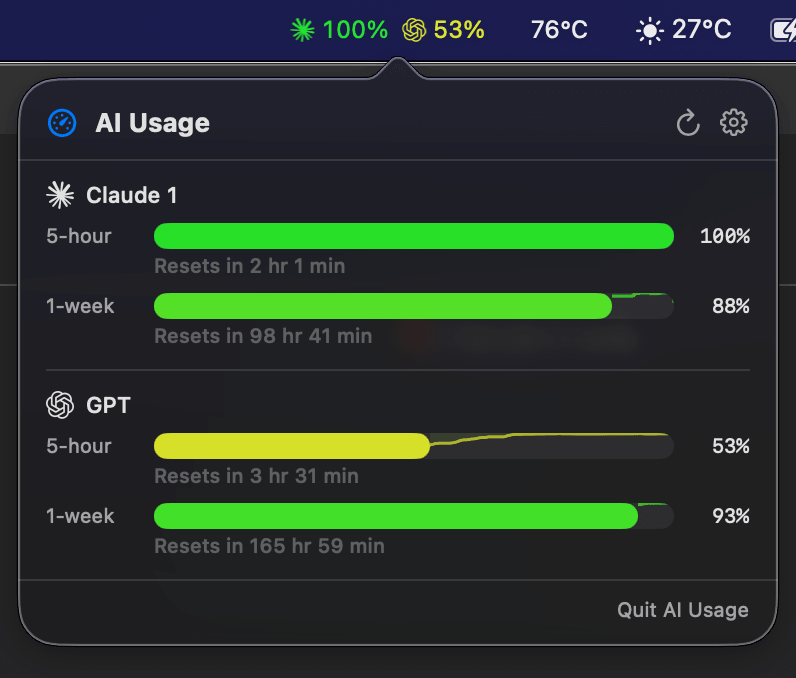
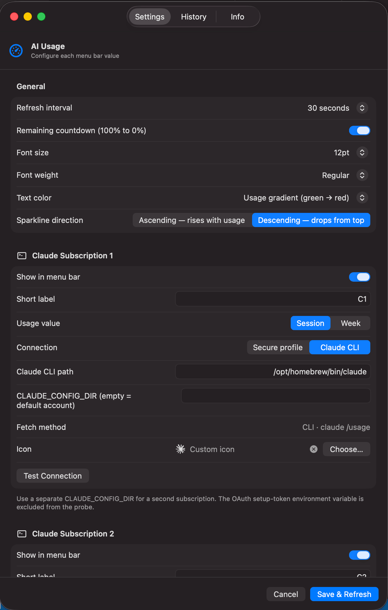
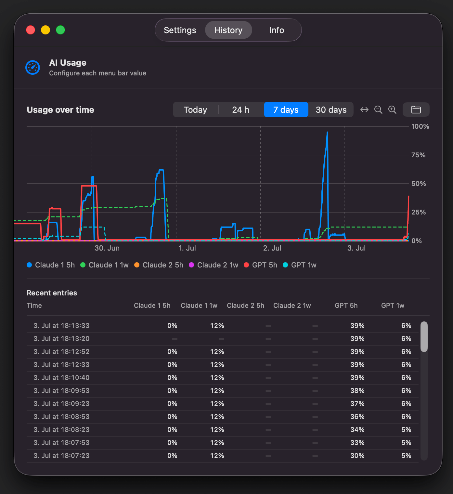

# AI Usage

A lightweight macOS menu bar app that shows your Claude and Codex quota at a glance.

```
C1 43%  GPT 12%
```

Click the menu bar item to open a popover with per-provider details, burn-rate sparklines, and reset countdowns.

<div align="center">
  
  
  
</div>

## Requirements

- macOS 13 Ventura or later
- Swift 6 toolchain (Xcode 16+ or [swift.org](https://swift.org/download/))
- **`claude`** — [Anthropic Claude Code](https://claude.ai/code) installed and in `$PATH`
- **`codex`** — [OpenAI Codex CLI](https://github.com/openai/codex) installed and in `$PATH`

Each provider can be individually disabled in Settings if not installed.

## Build & Run

```bash
git clone https://github.com/DominikVsetecka/ai-usage.git
cd ai-usage
swift run AIUsage
```

Build a release binary:

```bash
swift build -c release
# binary is at .build/release/AIUsage
```

Print current values without starting the menu bar app:

```bash
swift run AIUsageSnapshot
```

### Running the binary on another machine

The compiled `AIUsage` binary is a plain command-line executable — there is no `.app` bundle, so double-clicking won't work directly. Options:

**Drag into Terminal** — drag `.build/release/AIUsage` from Finder into a Terminal window and press Return.

**Run from the shell:**
```bash
/path/to/AIUsage
```

**Keep it in your PATH:**
```bash
cp .build/release/AIUsage /usr/local/bin/ai-usage
ai-usage        # run from anywhere
```

**Launch on login with a shell script** — create `~/ai-usage.sh`:
```bash
#!/bin/bash
/usr/local/bin/ai-usage
```
Then make it executable and add it to System Settings → General → Login Items:
```bash
chmod +x ~/ai-usage.sh
```
macOS Gatekeeper may block the binary on first run. If you see a security warning, open System Settings → Privacy & Security, scroll down and click **Allow Anyway**.

> **Note:** `.command` files must be marked executable (`chmod +x`) before double-clicking works. macOS will still show a Gatekeeper prompt on first open for unsigned binaries.

## Features

- **Menu bar** — one value per enabled provider; configurable font size, weight, and color mode (white / dimmed / usage gradient)
- **Popover** — 5-hour and 1-week quota windows per provider with integrated burn-rate sparkline, percentage, and reset countdown ("Resets in 2 hr 15 min")
- **Window-scoped sparklines** — burn history is cropped to the active 5-hour or 1-week quota window
- **Sparkline direction** — ascending (usage rises, default) or descending (quota drops from top)
- **Local history** — usage logged to `~/.ai-usage/history/YYYY-MM-DD.jsonl` on ≥1% change or every 30 min; 30-day retention
- **History tab** — line chart with 1-day / 7-day / 30-day picker; "Show in Finder" button opens the history folder
- **Secure Claude profiles** — OAuth credentials imported into a separate app-owned Keychain entry; never touches Claude Code's own login
- **Custom icons** — pick any SVG or PNG per provider via file picker; stored as Base64 in `config.json`; no brand logos are bundled
- **Configurable refresh** — 15 s / 30 s / 1 min / 2 min / 5 min

## Configuration

First launch creates a default config at `~/.ai-usage/config.json`. All settings are editable via the popover's gear icon.

History is stored at `~/.ai-usage/history/` and is not committed to git.

### Two Claude accounts

**Recommended: Secure profile mode**

Each account gets its own isolated Keychain entry. After setup the `claude` CLI is no longer needed for those sources.

> **Why does it access the Keychain?**
> Secure profile mode imports the OAuth token that Claude Code already stored on your Mac — it reads from the existing Keychain item once, copies it into a *separate, app-owned* entry under the service name `ai-usage`, and never touches the original again. This lets AI Usage authenticate directly to the Claude API without keeping the CLI running. You can verify this in Keychain Access.app by searching for "ai-usage". No credentials are written to disk or transmitted anywhere other than the Anthropic API.

1. Make sure Claude Code CLI is logged in with your **first** account.
2. Settings → Claude 1 → Connection: **Secure profile** → "Import Current Claude Account" → Save & Refresh.
3. In your terminal, switch Claude Code to the second account:
   ```bash
   claude auth logout
   claude auth login   # log in with the second account
   ```
4. Settings → Claude 2 → Connection: **Secure profile** → "Import Current Claude Account" → Save & Refresh.
5. Switch Claude Code back to whichever account you use interactively:
   ```bash
   claude auth logout
   claude auth login
   ```

AI Usage never writes to Claude Code's own Keychain item or `~/.claude.json`.

**Alternative: CLI mode with separate config directories**

```bash
CLAUDE_CONFIG_DIR=~/.claude-account-2 claude auth login
```

Enable Claude 2 in Settings, set Connection to **Claude CLI**, and set `CLAUDE_CONFIG_DIR` to `~/.claude-account-2`. Both accounts run via the CLI in parallel; no Keychain import needed.

## Privacy

- No telemetry, no analytics, no network requests beyond the CLIs you configure
- All data stays locally under `~/.ai-usage/`
- History files and `config.json` live in `~/.ai-usage/` — never inside the app bundle or repo
- In secure profile mode, credentials are stored in app-owned macOS Keychain entries (service: `ai-usage`); the original Claude Code Keychain item is never modified
- No account data, tokens, or personal information is committed to this repository

## License

MIT

---

by [Dominik Vsetecka](https://github.com/DominikVsetecka)
